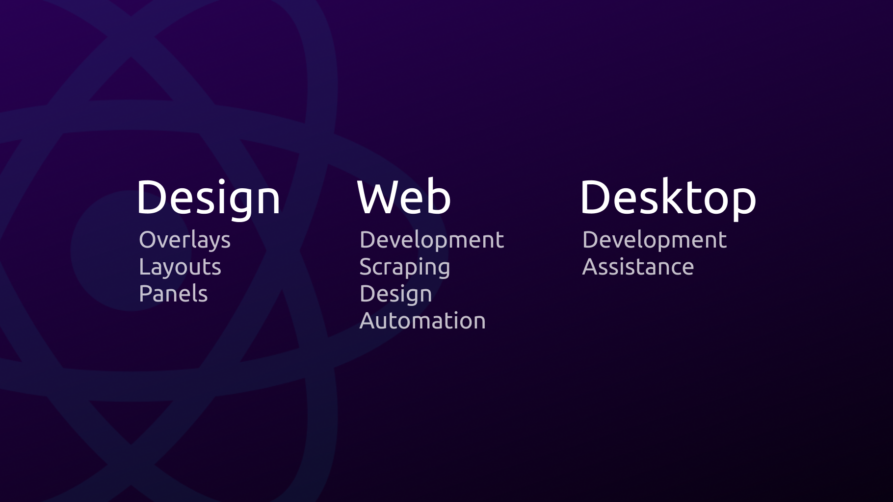

<h1>Hey there 👋, I'm Antonio</h1>

###

<h3>An information technology student who loves to transform his ideas into reality</h3>

###

  
  
  
  
  
  
  
  
  
  
  
  
  
  
  
  
  
  
  
  
  
  
  
  
  
  
  
  

###

- 🔭 I’m currently working on [dlpal](github.com/antoniojsanchezm/dlpal)

- 🌱 I’m currently learning to use **Electron** and how to code in **PHP**

- 🤝 I’m looking for help with **everything I can**

- 💬 Ask me about **JavaScript, React, Node.js, MongoDB, Tailwind CSS**

- 📫 Reach me at **antoniojsm8090@gmail.com**

  
  
  <h3>Connect with me:</h3>
  
  <h3>Support me:</h3>
  

